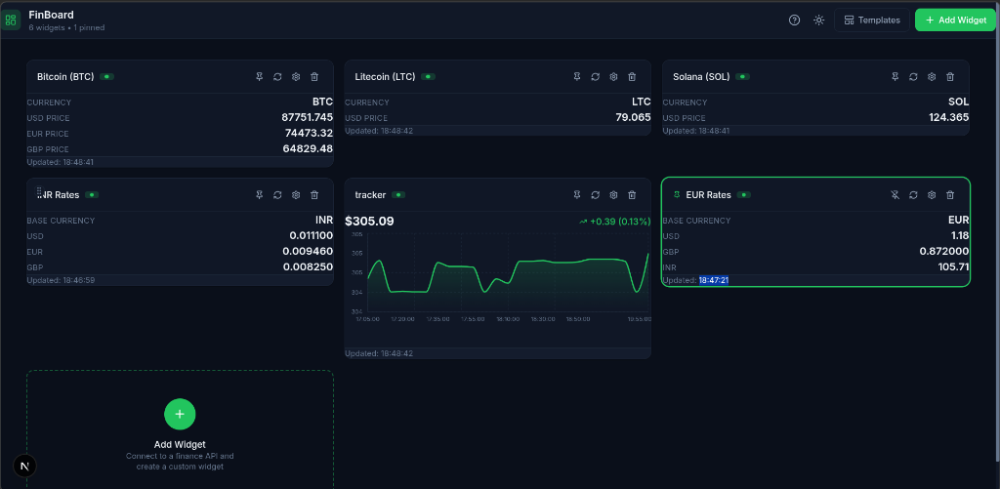
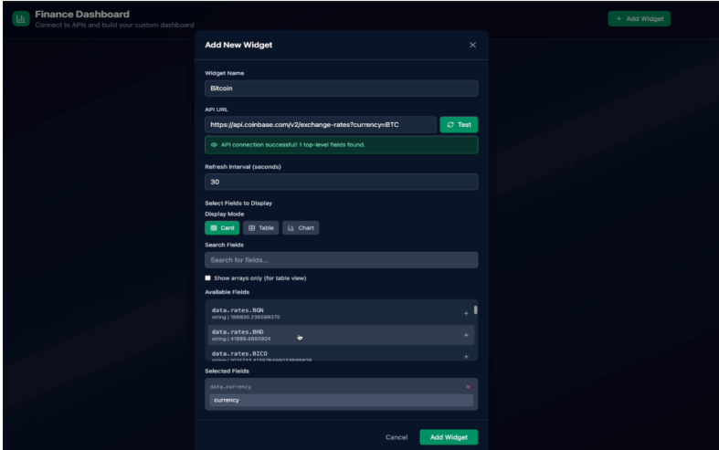
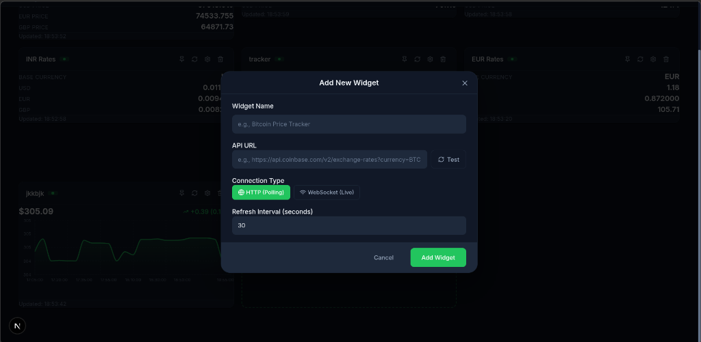

# FinBoard - Customizable Finance Dashboard

A real-time finance monitoring dashboard built with Next.js where users can build their own dashboard by connecting to various financial APIs and displaying real-time data through customizable widgets.


---

## 📸 Demo Screenshots

### Dashboard Overview

*Multiple widgets displaying crypto prices, forex rates, and charts with real-time updates*

### Add Widget Modal

*Connect to any API, test the connection, and select fields to display*

### Connection Types

*Choose between HTTP polling or WebSocket for live data*

---

## ✅ Features Implemented (Mapped to Requirements)

### 1. Widget Management System

| Requirement | Status | Implementation |
|-------------|--------|----------------|
| **Add Widgets** | ✅ | Users can create widgets by connecting to any financial API |
| **Table View** | ✅ | Time series data displayed in paginated table format |
| **Finance Cards** | ✅ | Card view for watchlist, prices, rates with real-time data |
| **Charts** | ✅ | Area charts with OHLC data (Daily, Intraday support) |
| **Remove Widgets** | ✅ | Easy deletion with confirmation toast |
| **Rearrange Layout** | ✅ | Full drag-and-drop functionality using @dnd-kit |
| **Widget Configuration** | ✅ | Edit widget settings, change API, modify fields |

### 2. API Integration & Data Handling

| Requirement | Status | Implementation |
|-------------|--------|----------------|
| **Dynamic Data Mapping** | ✅ | JSON explorer shows all available fields from API response |
| **Real-time Updates** | ✅ | Configurable refresh intervals (5s - 5min) per widget |
| **Data Caching** | ✅ | Intelligent caching with TTL, request deduplication, localStorage persistence |
| **Multiple APIs** | ✅ | Works with Coinbase, ExchangeRate-API, Alpha Vantage, any REST API |

### 3. User Interface & Experience

| Requirement | Status | Implementation |
|-------------|--------|----------------|
| **Customizable Widgets** | ✅ | Editable titles, custom field labels, display mode selection |
| **Responsive Design** | ✅ | Mobile, tablet, desktop layouts with CSS Grid |
| **Loading States** | ✅ | Spinner animations during data fetch |
| **Error States** | ✅ | Error messages with retry button |
| **Empty States** | ✅ | Helpful empty dashboard with quick-start options |

### 4. Data Persistence

| Requirement | Status | Implementation |
|-------------|--------|----------------|
| **Browser Storage** | ✅ | All widget configs persist in localStorage |
| **State Recovery** | ✅ | Complete dashboard restoration on page refresh |
| **Theme Persistence** | ✅ | Theme preference saved across sessions |

### 5. Advanced Widget Features

| Requirement | Status | Implementation |
|-------------|--------|----------------|
| **Field Selection Interface** | ✅ | Interactive field explorer with search and filters |
| **Custom Formatting** | ✅ | Currency, percentage, compact number formatting |
| **Widget Naming** | ✅ | User-defined widget titles |
| **API Endpoint Management** | ✅ | Edit widget to change API endpoint anytime |

---

## ⭐ Brownie Points - ALL IMPLEMENTED

| Brownie Point | Status | Implementation Details |
|---------------|--------|------------------------|
| **🎨 Dynamic Theme Switching** | ✅ | Light/Dark mode toggle with smooth transitions, persisted in localStorage |
| **📡 Real-time Data (WebSocket)** | ✅ | WebSocket connection type option for live data updates |
| **📋 Dashboard Templates** | ✅ | Pre-built Crypto Tracker and Forex Monitor templates |
| **📌 Widget Pinning** | ✅ | Pin important widgets to top, pinned widgets can't be moved |
| **🔄 Request Deduplication** | ✅ | Prevents duplicate API calls for same resource |
| **💾 Smart Caching** | ✅ | In-memory + localStorage with configurable TTL per API type |

---

## 🛠 Tech Stack (As Required)

| Technology | Purpose | Requirement Met |
|------------|---------|-----------------|
| **Next.js 16** | Frontend Framework | ✅ |
| **TypeScript** | Type Safety | ✅ |
| **Tailwind CSS** | Styling | ✅ |
| **Zustand** | State Management | ✅ (Alternative to Redux) |
| **Recharts** | Data Visualization | ✅ |
| **@dnd-kit** | Drag and Drop | ✅ |
| **Vercel Ready** | Deployment | ✅ |

---

## 📁 Scalable Folder Structure

```
src/
├── app/                          # Next.js App Router
│   ├── globals.css               # CSS variables, themes, components
│   ├── layout.tsx                # Root layout with providers
│   └── page.tsx                  # Main dashboard page
│
├── components/
│   ├── dashboard/                # Dashboard-specific components
│   │   ├── Dashboard.tsx         # Main dashboard with DnD context
│   │   ├── WidgetCard.tsx        # Widget rendering (Card/Table/Chart)
│   │   ├── AddWidgetModal.tsx    # Widget creation modal
│   │   ├── TemplateModal.tsx     # Dashboard templates
│   │   └── DocsModal.tsx         # In-app documentation
│   │
│   └── ui/                       # Reusable UI components
│       ├── Toast.tsx             # Toast notification system
│       └── ConfirmModal.tsx      # Confirmation dialogs
│
├── context/
│   └── ThemeContext.tsx          # Dark/Light theme provider
│
├── store/
│   ├── index.ts                  # Store exports
│   └── dashboardStore.ts         # Zustand store (widgets, actions)
│
├── services/
│   ├── api/
│   │   ├── index.ts              # API exports
│   │   └── apiUtils.ts           # API testing, field extraction
│   ├── cacheService.ts           # Intelligent caching system
│   └── websocketService.ts       # WebSocket connection manager
│
├── types/
│   ├── index.ts                  # Type exports
│   └── widget.ts                 # Widget, Field, API types
│
└── utils/
    ├── apiAdapters.ts            # API response normalizers
    ├── formatters.ts             # Currency, number formatters
    ├── helpers.ts                # Utility functions
    └── templates.ts              # Dashboard templates
```

---

## 🚀 Getting Started

### Prerequisites
- Node.js 18+
- npm or yarn

### Installation

```bash
# Clone the repository
git clone https://github.com/aaanmmoool/FinBoard.git
cd FinBoard/finboard-app

# Install dependencies
npm install

# Start development server
npm run dev

# Open http://localhost:3000
```

### Using Free APIs (No API Key Required!)

The app works out of the box with **free APIs**:

| API | Data | Rate Limit |
|-----|------|------------|
| **Coinbase** | Crypto prices (BTC, ETH, LTC, SOL) | Unlimited |
| **ExchangeRate-API** | Forex rates (USD, EUR, INR, GBP) | 1500/month |

For stock data, get a free key from [Alpha Vantage](https://www.alphavantage.co/support/#api-key).

---

## 💡 Key Implementation Highlights

### State Management with Zustand

```typescript
const useDashboardStore = create<DashboardState>((set, get) => ({
    widgets: [],
    addWidget: (widget) => { ... },
    removeWidget: (id) => { ... },
    reorderWidgets: (activeId, overId) => { ... },
    togglePin: (id) => { ... },  // Moves pinned widgets to front
}));
```

### Intelligent Caching System

```typescript
// Cache with TTL based on API type
const ttlConfig = {
    'coinbase.com': 30000,      // 30 seconds for crypto
    'exchangerate-api': 120000, // 2 minutes for forex
    'alphavantage': 60000,      // 1 minute for stocks
};

// Request deduplication prevents duplicate API calls
const cachedFetch = async (url, options) => {
    if (pendingRequests.has(url)) {
        return pendingRequests.get(url); // Return existing promise
    }
    // ... fetch and cache
};
```

### Drag and Drop with Pinning

```typescript
// Pinned widgets can't be dragged or displaced
const handleDragEnd = (event) => {
    if (activeWidget?.isPinned || overWidget?.isPinned) {
        return; // Block the operation
    }
    reorderWidgets(activeId, overId);
};
```

---

## 📜 Scripts

```bash
npm run dev      # Start development server
npm run build    # Build for production
npm run start    # Start production server
npm run lint     # Run ESLint
```

---

## 🚀 Deployment

### Vercel (Recommended)

```bash
npm run build
vercel
```

The app works with free APIs - no environment variables required!

---

## 📊 API Error Handling

| Error | Handling |
|-------|----------|
| Rate Limit | Cached responses served, retry after cooldown |
| Network Error | Error state with retry button |
| Invalid Response | Graceful fallback with error message |
| CORS | Works with CORS-enabled APIs |

---

## 🎯 Evaluation Criteria Met

| Criteria | Implementation |
|----------|----------------|
| **Frontend Development** | Next.js 16, React 19, TypeScript, Component architecture |
| **State Management** | Zustand with persistence, efficient updates |
| **API Integration** | Dynamic JSON mapping, adapters for multiple formats |
| **User Experience** | Intuitive interface, drag-drop, theme toggle, validation |
| **Problem-Solving** | Flexible adapters for Alpha Vantage, Coinbase, Forex APIs |
| **Code Quality** | Clean architecture, TypeScript, reusable components |

---

## 📝 License

MIT License - feel free to use this project for learning or building your own finance dashboard!

---

## 🤝 Contributing

Contributions are welcome! Please feel free to submit a Pull Request.

---

**Built with ❤️ using Next.js, Zustand, and Recharts**
